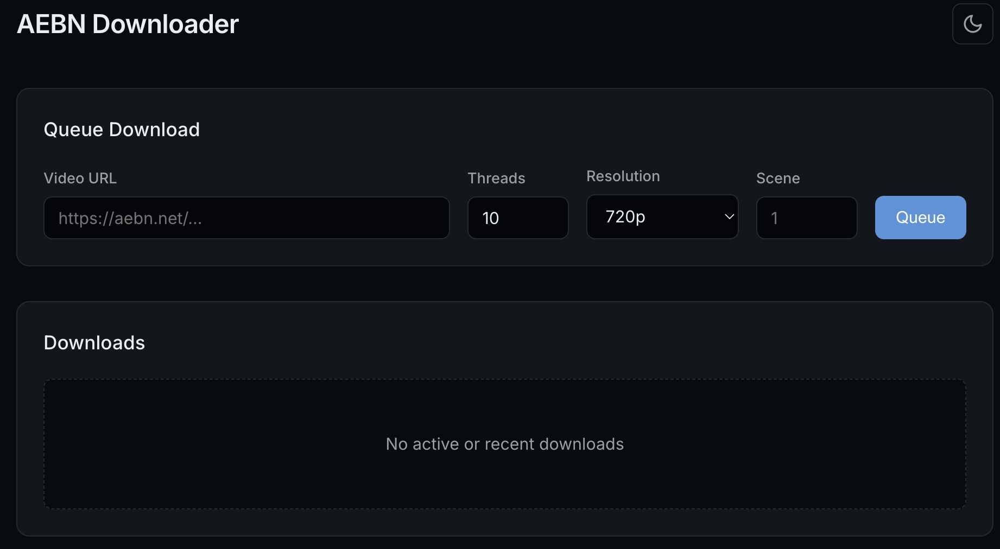
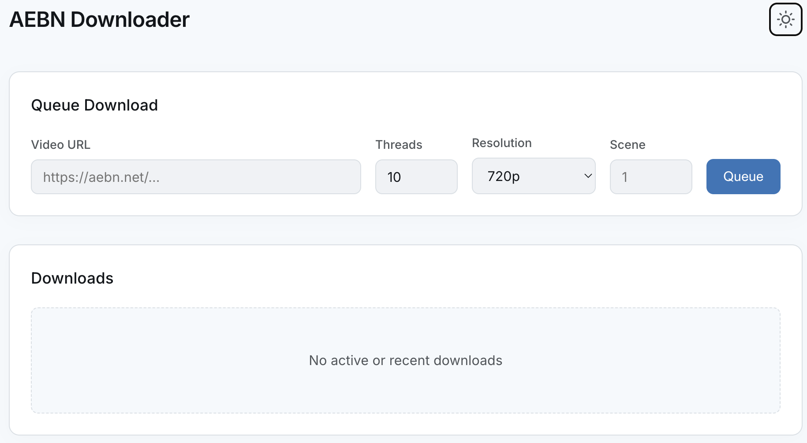

# aebndl-ui

A high-performance, containerized Web UI for the [aebn-vod-downloader](https://github.com/hyper440/aebn-vod-downloader).

> 🤖 **Vibe Coded**: This project was built and designed with [Antigravity](https://github.com/google/antigravity), Google's advanced agentic coding assistant.

## Screenshots

<p align="center">
  
  &nbsp; &nbsp;
  
</p>

## Features
- **Modern Web Dashboard**: Completely redesigned, minimalist, mobile-responsive card-based UI.
- **Smart Queueing**: Streamlined primary form (URL + Scene, defaulting to Scene 1) with quick-paste clipboard helper.
- **Advanced Downloader Controls**: Collapsible options for target resolution (4K–480p), thread concurrency, split scenes, performer names, and cover art.
- **Live Terminal Log Viewer**: Inspect real-time CLI output and failure diagnostics directly from the UI.
- **Smart Auto-Dismiss**: Completed downloads remain visible for 60 seconds before automatically clearing, with a one-click "Clear Completed" button.
- **Event-Driven SSE**: Ultra-low-latency, zero-idle-CPU status streaming with automatic keepalive heartbeat.
- **Security Hardened**: Protected against DOM XSS, path traversal, and command injection; includes HTTP security headers and optional HTTP Basic Auth.
- **Dynamic Theming**: First-class support for both Light and Dark modes using modern OKLCH colors.
- **Smart Source Tracking**: Automatically checks upstream for updates and rebuilds with local fallback.
- **Containerized**: Runs anywhere with Docker.

## Usage

### With Docker (Recommended)

Create a `compose.yaml` file:

```yaml
services:
  aebndl-ui:
    image: ghcr.io/landcraft/aebndl-ui:latest
    container_name: aebndl-ui
    ports:
      - "21345:21345"
    volumes:
      - ./downloads:/downloads
    environment:
      DOWNLOAD_DIR: '/downloads'
      # Optional HTTP Basic Authentication:
      # AUTH_USERNAME: 'admin'
      # AUTH_PASSWORD: 'your-secure-password'
    restart: unless-stopped
```

Run it:
```bash
docker compose up -d
```
Access the dashboard at `http://localhost:21345`.

### Manual
1. Install dependencies:
   ```bash
   pip install -r src/requirements.txt
   ```
2. Run the server:
   ```bash
   uvicorn src.main:app --host 0.0.0.0 --port 21345
   ```

## Configuration
- `DOWNLOAD_DIR`: Path to save downloads (default: `./downloads`).
- `AUTH_USERNAME`: *(Optional)* Basic Auth username.
- `AUTH_PASSWORD`: *(Optional)* Basic Auth password. When both `AUTH_USERNAME` and `AUTH_PASSWORD` are set, the UI requires authentication. If omitted (e.g. when behind Cloudflare Zero Trust or on private LAN), access is open.

The project includes an `update_source.sh` script that runs automatically in the Docker build process/CI to fetch the latest upstream downloader code.

## Attribution
This project uses the core downloading logic from the **aebn-vod-downloader** project.
- **Original Source**: [https://github.com/hyper440/aebn-vod-downloader](https://github.com/hyper440/aebn-vod-downloader)
- **Credits**: `estellaarrieta`, `hyper440`

See [NOTICE](NOTICE) and [ATTRIBUTION.md](ATTRIBUTION.md) for more details.
